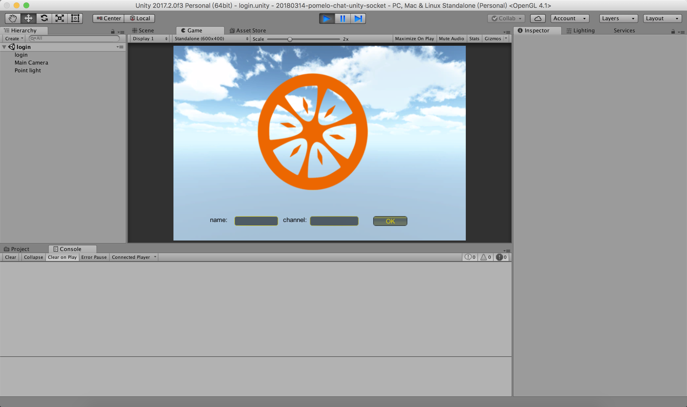
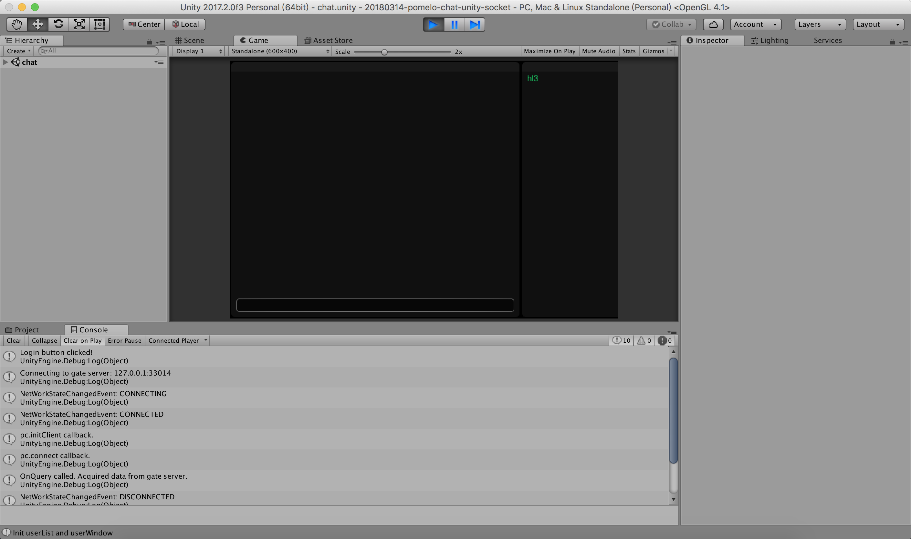
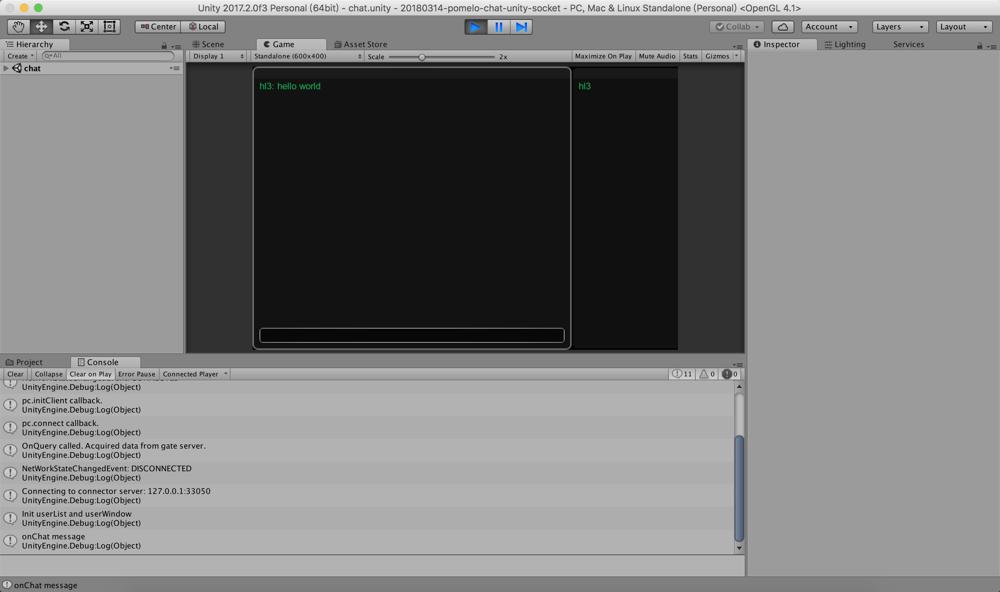

# pomelo-chat-unity-socket

适用于 Pomelo 聊天服务器教程的 Unity 版客户端。使用原生 socket。

本项目参照了官方的 [NetEase/pomelo-unitychat-socket](https://github.com/NetEase/pomelo-unitychat-socket)，因为其最后更新时间（20180314 17:15检查）是2013.4.22，已经不再适用当前的 unity 版本，与 pomelo 官方 sdk 也不兼容了。所以进行更新。

# 界面预览

## 登录界面

## 聊天界面

# 依赖

本项目是客户端，使用官方的 unity 插件 [NetEase/pomelo-unityclient-socket](https://github.com/NetEase/pomelo-unityclient-socket) 。服务器端参考官方示例 [NetEase/chatofpomelo](https://github.com/NetEase/chatofpomelo)制作了 docker 封装环境后的版本 [Pomelo-chat](https://github.com/HustLion/pomelo-chat)。

Unity 版本为 `2017.2.0f3.`

# 运行

用 Unity 打开 Assets/scenes/login，点击运行按钮即可。

# 主要修改点

* PomeloClient 的 API 调用方式修改为最新。
* LoginGUI 跳转下一场景的逻辑修改，之前不在 Update() 中，直接出错（`INTERNAL_CALL_GetActiveScene can only be called from the main thread.`）
* 将无法使用的 pomelo-dotnetClient.dll 插件换成官方最新源码。
* 移除一些丢失的依赖。
* 增加 .gitignore
* ChatGUI 的界面颜色，之前的背景和文字的颜色几乎相同。
* 增加、合并 LICENSE 信息

# TODO

* [] 将源码编译成 dll，如果有问题，进行一些修改 https://github.com/HustLion/pomelo-unityclient-socket

# 参考资料

* [Pomelo+unity3d采坑日志](http://blog.csdn.net/qq_32725345/article/details/60467499) 文章中提到的点都是重点，避开了好多坑。
* [pomelo踩坑记](http://blog.csdn.net/comhaqs/article/details/70790104)

